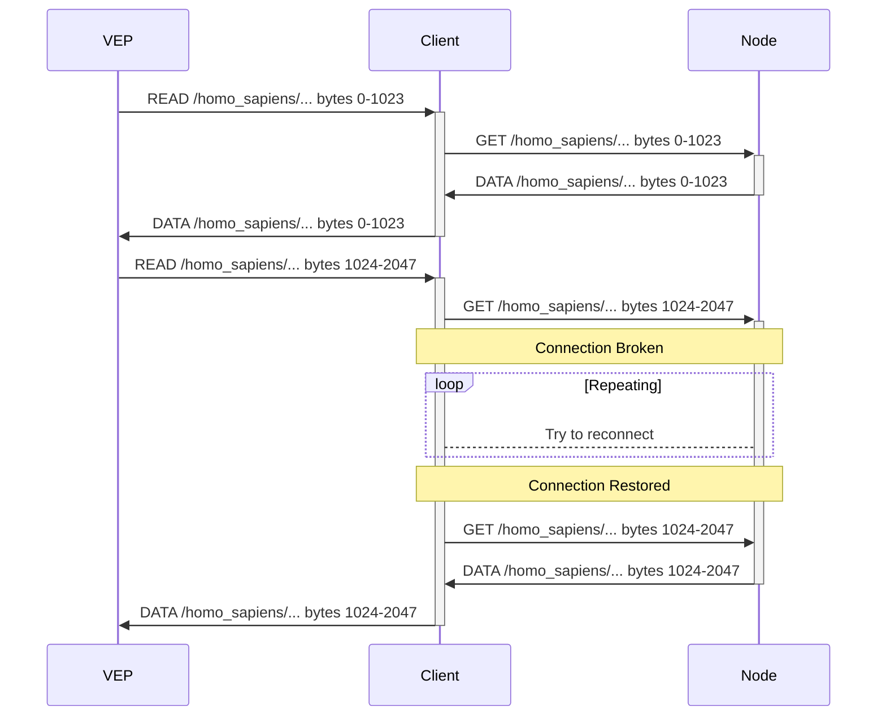
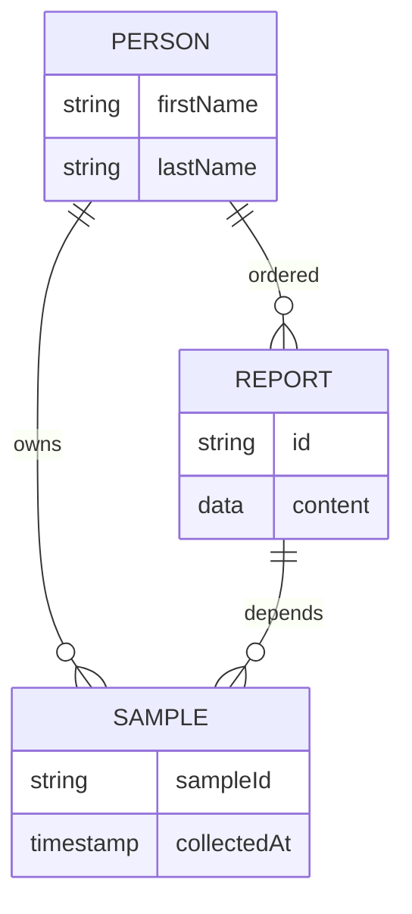

## Zenome Storage System

**High-performance storage system for genomic data**

* Works in both distributed systems and private networks
* Takes into account the specificity of big genomic data during their storage and processing
* Unlimited potential for customization through modularity
* The system components can be implemented in stages, as needed

Zenome Storage System is designed as a foundation for creating Genomics-IDE - an integrated environment for efficient work with genetic data.
For example, Zenome Storage System has the following features:

* Genomic data flow management and systematization
* Transparent use of containers for isolation of working environments
* Instant deployment of the desired runtime environment
* Access control system based on cryptographic evidence (optional)
* Support for standard containers for storing genetic data
* Data normalization: consideration of vendor-specific features of format subspecies

**Each data type needs a special approach**

Working with genetic data includes operations with data of different types, which leads to significantly different requirements for both hardware and software that deals with data of a certain type.

1. Raw Sequence (fastq, uBAM): _data from DNA sequencing lab_

   * Starting point for primary analysis and reanalysis of data in the future
   * Significant data size (up to 500Gb)
   * Practically not used directly
   * Unable to recover when lost

    > **The priority in working with this type of data in the Zenome Storage System  --- is to ensure their safety.**  


2. Aligned sequence data (formats: SAM, BAM, CRAM)

   * Derived from raw data
   * Significant data size (up to 500Gb)
   * Can be used directly (e.g. visualizations of aligned reads)
   * Can be deleted and restored later if necessary

    > **Priority in dealing with this type of data in Zenome Storage System --- is to make them available if needed and minimize storage costs.**

3. Sequence variation data (formats: VCF, GVCF, TXT, etc)

    * Непосредственно характеризуют отличия в последовательности ДНК
    * Умеренный размер данных. Удаление для освобождения места не имеет смысла.
    * Используются для получения клинической интерпретации и еще много где.
    * Зачастую в задачах требуется лишь небольшая определенная часть данных.
    * Огромное количество несовместимых между собой разновидностей VCF.
    * Распространенная практика внесения в VCF данных из баз аннотаций усложняет обработку


**Zenome Storage System**

Zenome Storage System представляет собой программно определеяемую систему хранения геномных данных. При разворачивании системы пользователь устанавливает управляющую программу на нескольких серверах, работающих под управлением Unix-совместимой операционной системы (рекомендуется использовать современные дистрибутивы Linux).

Затем с помощью специального скрипта формируется начальная конфигурация системы, в том числе и настраивается способ авторизации для администратора, число узлов, их сетевые адреса или имена. Система сгенерирует для каждого узла конфигурационный файл, а также приватный ключ для администратирования. Конфигурационные файлы применяются на соответствующих узлах при запуске управляющей программы, после чего (если есть сетевая доступность) сервера обнаруживают друг друга и формируют единый кластер.

После этого пользователь на каждом узле настраивает хранилище данных, указывая как и где узел может разместить данные. Каждый способ хранения представляет собой независимый модуль, который берет на себя реализацию взаимодействия с соответствующим бэкэндом. Поддержка локального хранения на сервере, а также популярных сетевых протоколов (FTP, SMB, iscsi и так далее) реализована в стандартных модулях, доступных по умолчанию. Кроме того существуют модули-адаптеры для интеграции популярных облачных сервисов как мест хранения данных.

После этого пользователю предлагается настроить политики хранения данных, настраивая либо с нуля (не рекомендуется для большинства пользователей), либо используя пресеты с популярными вариантами. Политики представляют собой декларативную конфигурацию для того, как будут распределяться данные в системе, какое должно использоваться число независимых дублирований данных, применяется ли шифрование, формируются группы для пользователей системы и настраиваются их права.

Затем создается ряд пользователей, которые получают возможность работать с системой одним из доступных способов: консольный клиент (Win/Linux/Mac), оконное приложение (Win/Linux/Mac) или же через Web interface (Win/Linux/Mac/Android/iOS/...). В простейшем случае авторизация пользователей происходит по паролю: при регистрации администратор рассылает одноразовые пароли для доступа, которые пользователь меняет на свой при первом входе.

### Zenome Storage System и инкрементное аннотирование

Zenome Storage System проводит черту между данными, относящимися к образцу, и данными из базы аннотаций. Храня их отдельно, мы избегаем выбора между постоянным обновлением всех VCF и работой с устаревшими данными. Мы проанализировали причины, почему такой подход пользуется популярностью и предлагаем альтернативу --- инкрементное аннотирование. При нем аннотирование происходит на лету прямо внутри системы, и пользователю становится доступен "виртуальный проаннотированный файл", который он может скачать, просмотреть или отфильтровать и просмотреть результат.

Допустим имеется большое число образцов, которые нужно проанализировать по определенным базам вариантов, например ClinVar. Со временем выходят новые версии для базы аннотаций и чтобы всегда иметь свежие данные по образцам, раньше приходилось каждый раз перезапускать аннотирование каждого образца, а затем сравнивать с прошлой версией на предмет новых существенных данных. Zenome Storage System, работая данными именно как с генетическими данными, позволяет при обновлении базы аннотаций показать, для каких образцов это обновление будет существенно менять результат аннотаций.

```latex {cmd=true,hide=true}
\documentclass[tikz]{standalone}
\usepackage{lmodern}
\usetikzlibrary{shadows,chains,scopes,calc}
\usetikzlibrary{decorations.pathmorphing, shapes}

\begin{document}
\begin{tikzpicture}
    [
        start chain=going right,
        node distance=10mm,
        database/.style={
            thick,
            draw=black,
            top color=white,
            bottom color=black!10,
            font=\sffamily\small,
            minimum width=20mm,
            minimum height=15mm,
            drop shadow
        },
        userfile/.style={
            thick,
            draw=black,
            top color=green!20,
            bottom color=green!10,
            font=\sffamily,
            minimum width=10mm,
            minimum height=10mm
        },
        virtfile/.style={
            thick,
            draw=blue,
            top color=gray!10,
            bottom color=gray!10,
            font=\sffamily,
            minimum width=10mm,
            minimum height=10mm
        },
        deltadb/.style={
            thick,
            draw=black,
            top color=black!20,
            bottom color=black!10,
            font=\sffamily,
            minimum width=2mm,
            minimum height=15mm
        },
        every label/.style={
            font=\sffamily
        },
    ]
    \node[userfile, label={above:User's VCF}] at (-3,-6) (Variants) {};


    \node[on chain, database, label={above:ClinVar 2019-12}] (CV1) {};
    \node[on chain, database, label={above:ClinVar 2020-01}] (CV2) {};
    \node[on chain, database, label={above:ClinVar 2020-02}] (CV3) {};
    \node[on chain, database, label={above:ClinVar 2020-03}] (CV4) {};
    \node[on chain, database, label={above:ClinVar 2020-04}] (CV5) {};

    \node[deltadb, label={below:Delta}] at ($0.5*(CV1) + 0.5*(CV2) + (0,-2.5)$) (DCV1) {};
    \draw[thick,black] ($(CV1.south) + (+0.2, -0.1)$)
                    |- ($(DCV1.north)+ (+0, 0.5)$)
                    -| ($(CV2.south) + (-0.2, -0.1)$)
                       ($(DCV1.north)+ (+0, 0.5)$) -- (DCV1.north) ;


    \node[deltadb, label={below:Delta}] at ($0.5*(CV2) + 0.5*(CV3) + (0,-2.5)$) (DCV2) {};
    \draw[thick,black] ($(CV2.south) + (+0.2, -0.1)$)
                    |- ($(DCV2.north)+ (+0, 0.5)$)
                    -| ($(CV3.south) + (-0.2, -0.1)$)
                       ($(DCV2.north)+ (+0, 0.5)$) -- (DCV2.north) ;


    \node[deltadb, label={below:Delta}] at ($0.5*(CV3) + 0.5*(CV4) + (0,-2.5)$) (DCV3) {};
    \draw[thick,black] ($(CV3.south) + (+0.2, -0.1)$)
                    |- ($(DCV3.north)+ (+0, 0.5)$)
                    -| ($(CV4.south) + (-0.2, -0.1)$)
                       ($(DCV3.north)+ (+0, 0.5)$) -- (DCV3.north) ;


    \node[deltadb, label={below:Delta}] at ($0.5*(CV4) + 0.5*(CV5) + (0,-2.5)$) (DCV4) {};
    \draw[thick,black] ($(CV4.south) + (+0.2, -0.1)$)
                    |- ($(DCV4.north)+ (+0, 0.5)$)
                    -| ($(CV5.south) + (-0.2, -0.1)$)
                       ($(DCV4.north)+ (+0, 0.5)$) -- (DCV4.north) ;


    \node[virtfile, label={above:Annotated with}, label={below:ClinVar 2019-12}] at ($(CV1) + (0, -6)$) (UCV1) {};
    \node[virtfile, label={above:Annotated with}, label={below:ClinVar 2020-01}] at ($(CV2) + (0, -6)$) (UCV2) {};
    \node[virtfile, label={above:Annotated with}, label={below:ClinVar 2020-02}] at ($(CV3) + (0, -6)$) (UCV3) {};
    \node[virtfile, label={above:Annotated with}, label={below:ClinVar 2020-03}] at ($(CV4) + (0, -6)$) (UCV4) {};
    \node[virtfile, label={above:Annotated with}, label={below:ClinVar 2020-04}] at ($(CV5) + (0, -6)$) (UCV5) {};

    \draw[black,->] (CV1) + (-5,0) -> (CV1);
    \draw[black,->] (CV1) -> (CV2);
    \draw[black,->] (CV2) -> (CV3);
    \draw[black,->] (CV3) -> (CV4);
    \draw[black,->] (CV4) -> (CV5);
    \draw[black,->] (CV5) -> +(5,0);

    \draw[blue,->] (Variants) -> (UCV1);
    \draw[blue,->] (UCV1) -> (UCV2);
    \draw[blue,->] (UCV2) -> (UCV3);
    \draw[blue,->] (UCV3) -> (UCV4);
    \draw[blue,->] (UCV4) -> (UCV5);

    \draw[black, very thick,->, ] (CV1) -> ($(UCV1) + (0,1)$) node[midway,fill=white] {Annotate};
    \draw[black!60, very thick,->, ] (DCV1) +(0,-1.25) |- +(1,-3.4) node[midway,below=0.15,fill=white] {Update};
    \draw[black!60, very thick,->, ] (DCV2) +(0,-1.25) |- +(1,-3.4) node[midway,below=0.15,fill=white] {};
    \draw[black!60, very thick,->, ] (DCV3) +(0,-1.25) |- +(1,-3.4) node[midway,below=0.15,fill=white] {};
    \draw[black!60, very thick,->, ] (DCV4) +(0,-1.25) |- +(1,-3.4) node[midway,below=0.15,fill=white] {};


\end{tikzpicture}
\end{document}
```

> Например, в 2020 году в ClinVar был добавлен вариант `NM_003000.3(SDHB):c.332T>C (p.Leu111Pro)`, классифицируемый как `Likely pathogenic​`. Zenome Storage System в этом случае для всех образцов, в которых такой вариант присутствует, обновила бы виртуальный файл аннотации, а также бы уведомила пользователя о существенном обновлении аннотаций. Соотвтетсвующая запись появится на странице образца в приложении-клиенте или в выдаче консольного клиента, а также на странице информации о базе аннотации появится запись, о том для скольки образцов изменились аннотации. Пользователь может настроить дополнительные средства уведомления при желании (например, уведомить лечащего врача).

Чтобы избежать уведомлений о несущественных изменениях, пользователь может указать, что считать важным. Например, в приведенном выше примере это может быть изменение категории варианта с "патогенность не определена" на "патогенный" или появление новой записи, причем как VUS, так и патогенной. Система позволяет просто указать какие поля считать важными. Кроме того, есть экспериментальная возможность задавать сложные условия на специальном языке специально для тех случаев, когда простым способом задать желаемое условие невозможно.

### Прозрачная работа с файлами в Zenome Storage System без сохранения на диске

На современных версиях Linux и Mac (поддержка Windows ожидается) существует возможность работать с файлами, находящимися в сети, как будто они расположены на диске вашего компьютера. Для этого пользователь через консольную утилиту или десктопный клиент выбирает пустую папку на своем компьютере и файлы, которые следует в эту папку отобразить. Указанные файлы появляются в этой папке и пользователь может использовать привычные инструменты, работающие с файлами на диске, для работы с ними. Поддерживается произвольное чтение, то есть можно запросить по индексу желаемый геномный интервал и скачана будет только требуемая часть файла.

Еще больший интерес эта возможность представляет по отношению к файлам крупных баз аннотаций, и Zenome Storage System поддерживает и этот случай. Пока ваш компьютер подключен к системе (по локальной сети или через интернет) вы можете использовать хранящиеся в системе файлы баз аннотаций как будто бы они расположены на вашей машине локально.


> Например, Ensembl Variant Effect Predictor требует для своей работы скачивание кеша и ресурсных файлов, совокупный размер которых в зависимости от желаемого функционала составляет размер до нескольких террабайт (так, база gnomAD v2.1.1 требует порядка 500гб, а gnomAD v3.1.1 --- несколько террабайт). Zenome Storage System позволяет использовать VEP как будто файлы присутствуют на компьютере при условии подключения к сети. При пропадании соединения (по любой причине, например, плохая связь) запущенный процесс анализа не падает с ошибкой, а просто ждет появления связности и продолжит работу как ни в чем не бывало.



### Zenome Storage System для организации файлов при помощи метаданных

Zenome Storage System при загрузке новых данных предлагает пользователю добавить метаданные к файлу, а также извлекает их из файла, если они уже там есть (например, в хедере VCF). Заполненные метаданные дают возможность использовать их в запросах, а также автоматически связывать несколько файлов по определенному признаку.

> Например, все файлы и виртуальные файлы, которые относятся к конкретному человеку объединяются в одну группу. На странице любого файла этой группы в разделе метаданные имеется возможность просмотреть этот список.



> Другой пример метаданных, это дата и место взятия образца для секвенирования, используемый прибор и так далее. Если появится подозрение, что какой-то прибор выдает некорректные данные, можно будет просмотреть весь список образцов, сделанных на нем в определенный период, изучить их и принять необходимые меры.

### Making use of Zenome Storage System for controlled disclosure of genetic data

Zenome Storage System enables the data owners (mostly patients) to sign up and only partially disclosure their genetic data. _This requires special configuration. The following are some possible use cases._

> Genetic reports require some subset of user's genetic data. So instead of uploading the whole data to the service provider, user makes use of special Zenome Storage System client. This piece of software may even be branded in the style of the service provider. Namely, the user registers the data in the system without even uploading it. After user has chosen the desired report, the system asks him to allow access to the needed set of alleles. If user agrees, this information is extracted from data and sent to the service provider. User then gets its report based on the information provided.

> The data owner wants to take part in genetic research by providing access to the subset of its data. The user makes use of special Zenome Storage System client (preconfigured by a research group) and registers his data in it. Optionally, user completes a questionnaire. After that, the researchers are enabled to make a query that executes on the data owner's computer. Only the results of computation are sent back to research team. User specifies a degree to which data are used when data is registered in the system.

### Virtually unlimited capabilities for customization

Zenome Storage System enables for flexible connection security policy that governs how may new nodes enter the network. Both centralized system and decentralized ones can be built using Zenome Storage System, depending on the policy used.

> The fully decentralized network enables the following use case of implementing a backup strategy. The nodes of said network stores encrypted pieces of data, and as such gain no access to it. When nodes are entering the network or leaving it, the system adjusts the number of replicas accordingly. For instance, the nodes may be just computers on the Internet, whose owners seek reward for temporary providing their unutilized disk capacity.