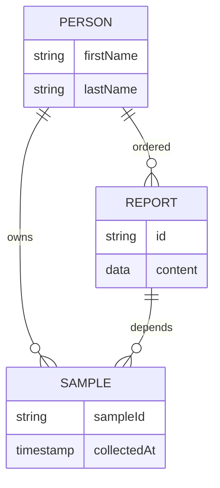

```mermaid
erDiagram
    REPORT {
        string id
        data   content
    }

    SAMPLE {
        string      sampleId
        timestamp   collectedAt
    }

    PERSON {
        string firstName
        string lastName
    }

    PERSON  ||--o{ SAMPLE : owns
    REPORT  ||--o{ SAMPLE : depends
    PERSON  ||--o{ REPORT : ordered
```