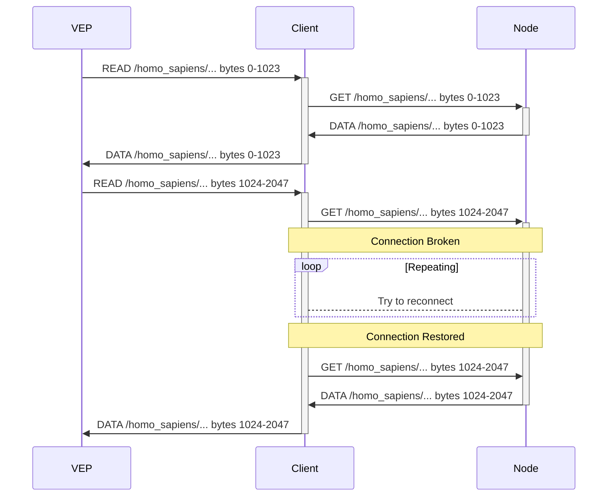

```mermaid
sequenceDiagram
    participant V as VEP
    participant C as Client
    participant S as Node

    V->>+C: READ /homo_sapiens/... bytes 0-1023
    C->>+S: GET /homo_sapiens/... bytes 0-1023
    S->>-C: DATA /homo_sapiens/... bytes 0-1023
    C->>-V: DATA /homo_sapiens/... bytes 0-1023

    V->>+C: READ /homo_sapiens/... bytes 1024-2047
    C->>+S: GET /homo_sapiens/... bytes 1024-2047

    Note over C,S: Connection Broken
    loop Repeating
        C-->S: Try to reconnect
    end
    Note over C,S: Connection Restored
    C->>S: GET /homo_sapiens/... bytes 1024-2047

    S->>-C: DATA /homo_sapiens/... bytes 1024-2047
    C->>-V: DATA /homo_sapiens/... bytes 1024-2047
```