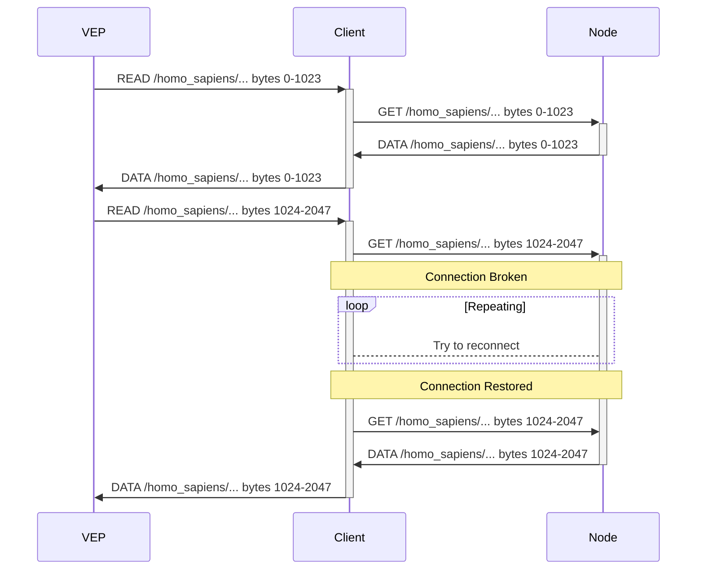
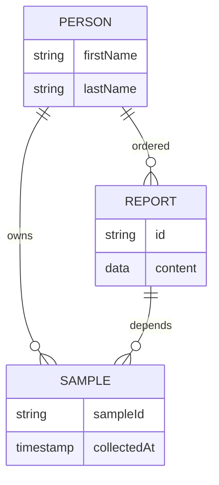

## Zenome Storage System

**Высокопроизводительная система хранения геномных данных**

* Работает как в распределенных системах, так и в частных сетях
* Учитывает особенности генетических данных при их хранении и обработке
* Неограниченный потенциал для кастомизации за счет модульности
* Компоненты системы можно внедрять постепенно, по мере надобности

Zenome Storage System задумывается как фундамент для создания Genomics-IDE,
интегрированной среды для эффективной работы с генетическими данными. Так,
например, Zenome Storage System имеет следующие особенности:

* Управление потоками геномных данных и их систематизация.
* Прозрачное использование контейнеров для изоляций рабочих сред
* Моментальное развертывание желаемой среды выполнения
* Система контроля доступа основанная на криптографических доказательствах (опц.)
* Поддержка стандартных контейнеров для хранения генетических данных
* Нормализация данных: учет vendor-specific особенностей подвидов форматов.

**К каждому типу данных нужен особый подход**

Работа с генетическими данными включает операции с данными разных типов, что приводит к существенно разным требованиям как к аппаратному, так и к программному обеспечению, которое имеет дело с данными определенного типа.

1. Raw Sequence (fastq, uBAM): _данные от ДНК-секвенатора_

   * Отправная точка для анализа и реанализа данных в будущем
   * Значительный размер данных (до 500Gb)
   * Практически не используются напрямую
   * Невозможно восстановить при потере

    > **Приоритет в работе с этим типом данным в Zenome Storage System --- обеспечить их сохранность.**  


2. Aligned sequence data (formats: SAM, BAM, CRAM)

   * Производные данные.
   * Значительный размер данных (дп 500Gb)
   * Могут использоваться напрямую (напр, визуализации картирования на референс)
   * Можно удалить и при необходимости восстановить позже.

    > **Приоритет в работе с этим типом данным в Zenome Storage System --- обеспечить их доступность при необходимости и минимизировать затраты на хранение.**

3. Sequence variation data (formats: VCF, GVCF, TXT, etc)

    * Непосредственно характеризуют отличия в последовательности ДНК
    * Умеренный размер данных. Удаление для освобождения места не имеет смысла.
    * Используются для получения клинической интерпретации и еще много где.
    * Зачастую в задачах требуется лишь небольшая определенная часть данных.
    * Огромное количество несовместимых между собой разновидностей VCF.
    * Распространенная практика внесения в VCF данных из баз аннотаций усложняет обработку


**Zenome Storage System**

Zenome Storage System представляет собой программно определеяемую систему хранения геномных данных. При разворачивании системы пользователь устанавливает управляющую программу на нескольких серверах, работающих под управлением Unix-совместимой операционной системы (рекомендуется использовать современные дистрибутивы Linux).

Затем с помощью специального скрипта формируется начальная конфигурация системы, в том числе и настраивается способ авторизации для администратора, число узлов, их сетевые адреса или имена. Система сгенерирует для каждого узла конфигурационный файл, а также приватный ключ для администратирования. Конфигурационные файлы применяются на соответствующих узлах при запуске управляющей программы, после чего (если есть сетевая доступность) сервера обнаруживают друг друга и формируют единый кластер.

После этого пользователь на каждом узле настраивает хранилище данных, указывая как и где узел может разместить данные. Каждый способ хранения представляет собой независимый модуль, который берет на себя реализацию взаимодействия с соответствующим бэкэндом. Поддержка локального хранения на сервере, а также популярных сетевых протоколов (FTP, SMB, iscsi и так далее) реализована в стандартных модулях, доступных по умолчанию. Кроме того существуют модули-адаптеры для интеграции популярных облачных сервисов как мест хранения данных.

После этого пользователю предлагается настроить политики хранения данных, настраивая либо с нуля (не рекомендуется для большинства пользователей), либо используя пресеты с популярными вариантами. Политики представляют собой декларативную конфигурацию для того, как будут распределяться данные в системе, какое должно использоваться число независимых дублирований данных, применяется ли шифрование, формируются группы для пользователей системы и настраиваются их права.

Затем создается ряд пользователей, которые получают возможность работать с системой одним из доступных способов: консольный клиент (Win/Linux/Mac), оконное приложение (Win/Linux/Mac) или же через Web interface (Win/Linux/Mac/Android/iOS/...). В простейшем случае авторизация пользователей происходит по паролю: при регистрации администратор рассылает одноразовые пароли для доступа, которые пользователь меняет на свой при первом входе.

### Zenome Storage System и инкрементное аннотирование

Zenome Storage System проводит черту между данными, относящимися к образцу, и данными из базы аннотаций. Храня их отдельно, мы избегаем выбора между постоянным обновлением всех VCF и работой с устаревшими данными. Мы проанализировали причины, почему такой подход пользуется популярностью и предлагаем альтернативу --- инкрементное аннотирование. При нем аннотирование происходит на лету прямо внутри системы, и пользователю становится доступен "виртуальный проаннотированный файл", который он может скачать, просмотреть или отфильтровать и просмотреть результат.

Допустим имеется большое число образцов, которые нужно проанализировать по определенным базам вариантов, например ClinVar. Со временем выходят новые версии для базы аннотаций и чтобы всегда иметь свежие данные по образцам, раньше приходилось каждый раз перезапускать аннотирование каждого образца, а затем сравнивать с прошлой версией на предмет новых существенных данных. Zenome Storage System, работая данными именно как с генетическими данными, позволяет при обновлении базы аннотаций показать, для каких образцов это обновление будет существенно менять результат аннотаций.

```latex {cmd=true,hide=true}
\documentclass[tikz]{standalone}
\usepackage{lmodern}
\usetikzlibrary{shadows,chains,scopes,calc}
\usetikzlibrary{decorations.pathmorphing, shapes}

\begin{document}
\begin{tikzpicture}
    [
        start chain=going right,
        node distance=10mm,
        database/.style={
            thick,
            draw=black,
            top color=white,
            bottom color=black!10,
            font=\sffamily\small,
            minimum width=20mm,
            minimum height=15mm,
            drop shadow
        },
        userfile/.style={
            thick,
            draw=black,
            top color=green!20,
            bottom color=green!10,
            font=\sffamily,
            minimum width=10mm,
            minimum height=10mm
        },
        virtfile/.style={
            thick,
            draw=blue,
            top color=gray!10,
            bottom color=gray!10,
            font=\sffamily,
            minimum width=10mm,
            minimum height=10mm
        },
        deltadb/.style={
            thick,
            draw=black,
            top color=black!20,
            bottom color=black!10,
            font=\sffamily,
            minimum width=2mm,
            minimum height=15mm
        },
        every label/.style={
            font=\sffamily
        },
    ]
    \node[userfile, label={above:User's VCF}] at (-3,-6) (Variants) {};


    \node[on chain, database, label={above:ClinVar 2019-12}] (CV1) {};
    \node[on chain, database, label={above:ClinVar 2020-01}] (CV2) {};
    \node[on chain, database, label={above:ClinVar 2020-02}] (CV3) {};
    \node[on chain, database, label={above:ClinVar 2020-03}] (CV4) {};
    \node[on chain, database, label={above:ClinVar 2020-04}] (CV5) {};

    \node[deltadb, label={below:Delta}] at ($0.5*(CV1) + 0.5*(CV2) + (0,-2.5)$) (DCV1) {};
    \draw[thick,black] ($(CV1.south) + (+0.2, -0.1)$)
                    |- ($(DCV1.north)+ (+0, 0.5)$)
                    -| ($(CV2.south) + (-0.2, -0.1)$)
                       ($(DCV1.north)+ (+0, 0.5)$) -- (DCV1.north) ;


    \node[deltadb, label={below:Delta}] at ($0.5*(CV2) + 0.5*(CV3) + (0,-2.5)$) (DCV2) {};
    \draw[thick,black] ($(CV2.south) + (+0.2, -0.1)$)
                    |- ($(DCV2.north)+ (+0, 0.5)$)
                    -| ($(CV3.south) + (-0.2, -0.1)$)
                       ($(DCV2.north)+ (+0, 0.5)$) -- (DCV2.north) ;


    \node[deltadb, label={below:Delta}] at ($0.5*(CV3) + 0.5*(CV4) + (0,-2.5)$) (DCV3) {};
    \draw[thick,black] ($(CV3.south) + (+0.2, -0.1)$)
                    |- ($(DCV3.north)+ (+0, 0.5)$)
                    -| ($(CV4.south) + (-0.2, -0.1)$)
                       ($(DCV3.north)+ (+0, 0.5)$) -- (DCV3.north) ;


    \node[deltadb, label={below:Delta}] at ($0.5*(CV4) + 0.5*(CV5) + (0,-2.5)$) (DCV4) {};
    \draw[thick,black] ($(CV4.south) + (+0.2, -0.1)$)
                    |- ($(DCV4.north)+ (+0, 0.5)$)
                    -| ($(CV5.south) + (-0.2, -0.1)$)
                       ($(DCV4.north)+ (+0, 0.5)$) -- (DCV4.north) ;


    \node[virtfile, label={above:Annotated with}, label={below:ClinVar 2019-12}] at ($(CV1) + (0, -6)$) (UCV1) {};
    \node[virtfile, label={above:Annotated with}, label={below:ClinVar 2020-01}] at ($(CV2) + (0, -6)$) (UCV2) {};
    \node[virtfile, label={above:Annotated with}, label={below:ClinVar 2020-02}] at ($(CV3) + (0, -6)$) (UCV3) {};
    \node[virtfile, label={above:Annotated with}, label={below:ClinVar 2020-03}] at ($(CV4) + (0, -6)$) (UCV4) {};
    \node[virtfile, label={above:Annotated with}, label={below:ClinVar 2020-04}] at ($(CV5) + (0, -6)$) (UCV5) {};

    \draw[black,->] (CV1) + (-5,0) -> (CV1);
    \draw[black,->] (CV1) -> (CV2);
    \draw[black,->] (CV2) -> (CV3);
    \draw[black,->] (CV3) -> (CV4);
    \draw[black,->] (CV4) -> (CV5);
    \draw[black,->] (CV5) -> +(5,0);

    \draw[blue,->] (Variants) -> (UCV1);
    \draw[blue,->] (UCV1) -> (UCV2);
    \draw[blue,->] (UCV2) -> (UCV3);
    \draw[blue,->] (UCV3) -> (UCV4);
    \draw[blue,->] (UCV4) -> (UCV5);

    \draw[black, very thick,->, ] (CV1) -> ($(UCV1) + (0,1)$) node[midway,fill=white] {Annotate};
    \draw[black!60, very thick,->, ] (DCV1) +(0,-1.25) |- +(1,-3.4) node[midway,below=0.15,fill=white] {Update};
    \draw[black!60, very thick,->, ] (DCV2) +(0,-1.25) |- +(1,-3.4) node[midway,below=0.15,fill=white] {};
    \draw[black!60, very thick,->, ] (DCV3) +(0,-1.25) |- +(1,-3.4) node[midway,below=0.15,fill=white] {};
    \draw[black!60, very thick,->, ] (DCV4) +(0,-1.25) |- +(1,-3.4) node[midway,below=0.15,fill=white] {};


\end{tikzpicture}
\end{document}
```

> Например, в 2020 году в ClinVar был добавлен вариант `NM_003000.3(SDHB):c.332T>C (p.Leu111Pro)`, классифицируемый как `Likely pathogenic​`. Zenome Storage System в этом случае для всех образцов, в которых такой вариант присутствует, обновила бы виртуальный файл аннотации, а также бы уведомила пользователя о существенном обновлении аннотаций. Соотвтетсвующая запись появится на странице образца в приложении-клиенте или в выдаче консольного клиента, а также на странице информации о базе аннотации появится запись, о том для скольки образцов изменились аннотации. Пользователь может настроить дополнительные средства уведомления при желании (например, уведомить лечащего врача).

Чтобы избежать уведомлений о несущественных изменениях, пользователь может указать, что считать важным. Например, в приведенном выше примере это может быть изменение категории варианта с "патогенность не определена" на "патогенный" или появление новой записи, причем как VUS, так и патогенной. Система позволяет просто указать какие поля считать важными. Кроме того, есть экспериментальная возможность задавать сложные условия на специальном языке специально для тех случаев, когда простым способом задать желаемое условие невозможно.

### Прозрачная работа с файлами в Zenome Storage System без сохранения на диске

На современных версиях Linux и Mac (поддержка Windows ожидается) существует возможность работать с файлами, находящимися в сети, как будто они расположены на диске вашего компьютера. Для этого пользователь через консольную утилиту или десктопный клиент выбирает пустую папку на своем компьютере и файлы, которые следует в эту папку отобразить. Указанные файлы появляются в этой папке и пользователь может использовать привычные инструменты, работающие с файлами на диске, для работы с ними. Поддерживается произвольное чтение, то есть можно запросить по индексу желаемый геномный интервал и скачана будет только требуемая часть файла.

Еще больший интерес эта возможность представляет по отношению к файлам крупных баз аннотаций, и Zenome Storage System поддерживает и этот случай. Пока ваш компьютер подключен к системе (по локальной сети или через интернет) вы можете использовать хранящиеся в системе файлы баз аннотаций как будто бы они расположены на вашей машине локально.


> Например, Ensembl Variant Effect Predictor требует для своей работы скачивание кеша и ресурсных файлов, совокупный размер которых в зависимости от желаемого функционала составляет размер до нескольких террабайт (так, база gnomAD v2.1.1 требует порядка 500гб, а gnomAD v3.1.1 --- несколько террабайт). Zenome Storage System позволяет использовать VEP как будто файлы присутствуют на компьютере при условии подключения к сети. При пропадании соединения (по любой причине, например, плохая связь) запущенный процесс анализа не падает с ошибкой, а просто ждет появления связности и продолжит работу как ни в чем не бывало.



### Zenome Storage System для организации файлов при помощи метаданных

Zenome Storage System при загрузке новых данных предлагает пользователю добавить метаданные к файлу, а также извлекает их из файла, если они уже там есть (например, в хедере VCF). Заполненные метаданные дают возможность использовать их в запросах, а также автоматически связывать несколько файлов по определенному признаку.

> Например, все файлы и виртуальные файлы, которые относятся к конкретному человеку объединяются в одну группу. На странице любого файла этой группы в разделе метаданные имеется возможность просмотреть этот список.



> Другой пример метаданных, это дата и место взятия образца для секвенирования, используемый прибор и так далее. Если появится подозрение, что какой-то прибор выдает некорректные данные, можно будет просмотреть весь список образцов, сделанных на нем в определенный период, изучить их и принять необходимые меры.

### Использование Zenome Storage System для частичного раскрытия данных

Zenome Storage System позволяет владельцам генетических данных (в первую очередь это сами пациенты) регистрироваться в системе и раскрывать их лишь частично. _Данная возможность требует специальной настройки. Далее приведены возможные сценарии использования._

> Например, для создания генетического отчета, требуется определенное подмножество генетических данных. Пользователь вместо того, чтобы передавать весь файл, используя специальный клиент Zenome Storage System (который может быть брендирован как клиент фирмы-поставщика отчетов), регистрирует этот файл в системе (без загрузки). После этого, выбрав желаемый отчет, система отправляет ему запрос на чтение определенного списка позиций из этого файла. В случае, если он соглашается, только указанные данные извлекаются из файла и отправляются в систему.

> Владелец геномных данных может пожелать принять участие в генетических исследованиях. Он также регистрирует файл с данными через специальную программу-клиент, подготовленную исследовательской группой, и опционально заполняет предлагаемые формы анкет. После этого исследователи могут сформировать запрос, который будет исполняться на компьютере владельца данных. Затем результаты вычислений отправляются исследовательской группы. (Объем передаваемых данных устанавливается владельцем при регистрации файла в системе)

### Практически неограниченные возможности по кастомизации

Zenome Storage System позволяет гибко настраивать политики для подключения новых узлов в сеть, давая возможность создавать как централизованные системы, так и децентрализованные.

> Существует возможность использовать полностью децентрализованную сеть для резервного хранения данных. Узлы такой сети хранят предварительно зашифрованную информацию и не могут получить к ней доступ. В момент добавления узла в сеть или выхода из сети, система корректирует число реплик согласно указанным политикам. Например, узлами такой сети могут быть компьютеры, подключенные к интернет, владельцы которых желают получить вознаграждение за предоставление своих неиспользуемых ресурсов жесткого диска.
